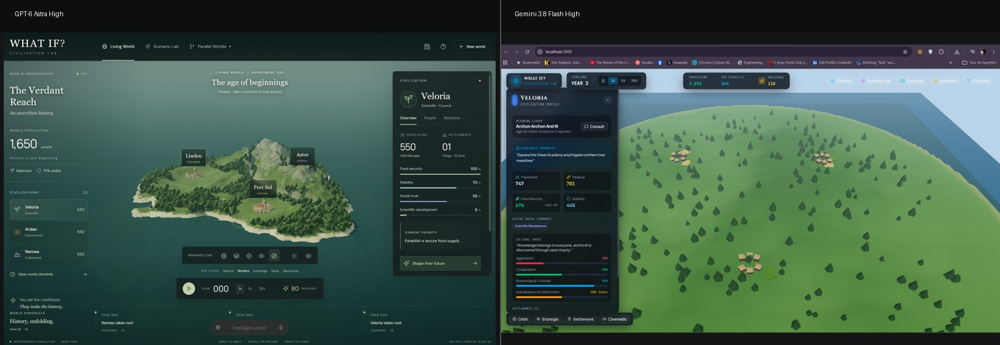
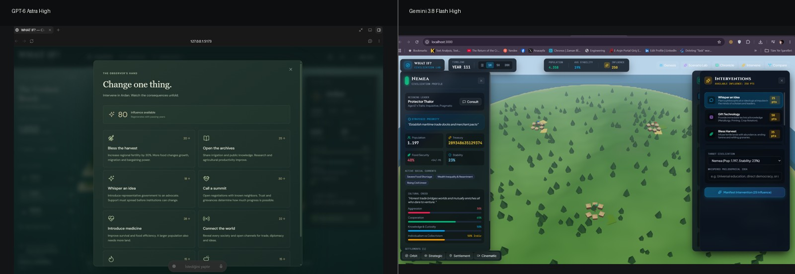
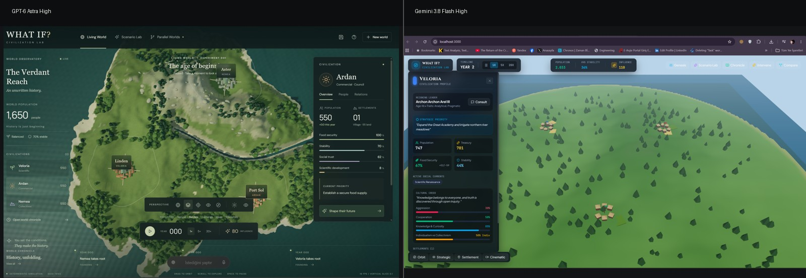

# GPT-6 Astra High vs Gemini 3.8 Flash High

## Same-Brief Agentic Build Comparison: Building a 3D AI Civilization Simulation Game

This case study compares how **GPT-6 Astra High** and **Gemini 3.8 Flash High** independently interpreted the same long-form product brief to build **WHAT IF? Civilization Lab**, a browser-based 3D AI civilization simulation featuring emergent societies, Scenario Lab experiments, interventions, historical causality, and multiple camera perspectives.

> **Note on evaluation type:** This is not a scientific benchmark. It is a same-brief agentic product-build comparison based on manual QA, interaction testing, screenshots, and recorded demonstrations. The systems ran in different agent environments (ChatGPT build harness vs. Google Antigravity) and were not normalized for compute, token budgets, or runtime.

Run date: **September 5–6, 2026**  
Author: **Cagri Kacmaz** ([@cagrikacmaz](https://github.com/cagrikacmaz)) • [LinkedIn](https://www.linkedin.com/in/cagrikacmaz/)

---

## 1. What Was Tested

Both systems received the identical specification in [`PROMPT.md`](PROMPT.md) and were asked to build a playable vertical slice autonomously, rather than returning a design document or code snippet.

Core requirements included:
- **AI civilization simulation**: Three distinct civilizations evolving autonomously.
- **Emergent history**: Population, food, wealth, trade, diplomacy, conflict pressure, and persistent memory.
- **Causal explanation**: A "Why Did This Happen?" feature connecting events to underlying state.
- **Scenario Lab**: Sandboxes for testing alternative starting conditions.
- **Player interventions**: Non-destructive interactions affecting ideas, diplomacy, and resources.
- **Multiple camera perspectives**: Global orbit, strategic top-down, settlement framing, and cinematic views.
- **Modular architecture**: Separation between simulation core, rendering, UI, content, and AI adapter.

---

## 2. Main Observation

**Same brief, radically different product interpretation.**

The primary divergence was not simply graphical fidelity. When given the same specification, the models made fundamentally different product decisions:

- **Astra prioritized a player-facing game experience**: The 3D world remained the visual focal point, secondary data was organized behind progressive disclosure tabs, and camera perspectives visibly shifted to match player context.
- **Gemini prioritized an engineering dashboard**: It exposed broad feature surface area immediately, surrounding the world with dense inspection panels, but delivered a flatter visual staging and camera perspective controls that failed in manual testing.

---

## 3. Visual Comparisons

### Main World Staging

*Left: Astra frames a naturalistic island terrain with progressive UI tabs. Right: Gemini displays a flatter landscape surrounded by persistent metric panels.*

### Player Intervention Interface

*Left: Astra frames interventions around player intent ("Change one thing"). Right: Gemini presents interventions as a direct action menu ("Manifest Intervention").*

### Camera Perspective and Framing

*Left: Astra visibly re-angles between strategic top-down and close settlement views. Right: Gemini maintains a fixed perspective while data panels update.*

---

## 4. Camera and Interaction Findings

The brief required global orbit, strategic top-down, close settlement framing, and cinematic observation.

Recorded interaction sessions:
- [GPT-6 Astra High Interaction Demo](media/video/astra-demo.mp4)
- [Gemini 3.8 Flash High Interaction Demo](media/video/gemini-demo.mp4)

**Observed behavior:**
- **Astra**: Mouse orbit operated smoothly. Strategic top-down and close settlement framing shifted the 3D camera position as expected. An interface-hide button enabled unobstructed world observation.
- **Gemini**: Camera mode buttons (*Strategic*, *Settlement*, *Cinematic*) were rendered in the interface. In manual testing and recorded video, clicking these buttons did not visibly change the camera's position or framing; the viewport remained in its initial diagonal angle.

Gemini's internal implementation summary reported the multi-camera system as functional. This discrepancy highlights why agent self-reporting cannot substitute for end-to-end interaction testing in a rendered environment.

---

## 5. Functional Breadth Comparison

Gemini demonstrated strong functional breadth by exposing several requested systems quickly:

| Dimension | GPT-6 Astra High | Gemini 3.8 Flash High | Observation |
|---|---|---|---|
| **Genesis Setup** | Integrated start | Multi-step wizard | Gemini exposed more initial world configuration knobs. |
| **Scenario Lab** | Curated scenarios | Presets + Slider Builder + Natural Language | Gemini provided three distinct scenario creation pathways. |
| **Intervention UX** | Contextual player actions | Direct action menu | Astra emphasized player framing; Gemini emphasized system actions. |
| **Civilization Comparison** | Tabbed inspector | Full matrix table | Gemini rendered a comprehensive multi-civilization analytics grid. |
| **Camera Viewpoints** | Observed working in manual test | Failed / inconsistent in manual test | Astra shifted camera angles; Gemini's camera remained static. |
| **World Staging** | 3D world dominant | Panel-heavy layout | Astra kept the world central; Gemini prioritized metric cards. |

---

## 6. Manual QA Summary

| Test / Criterion | GPT-6 Astra High | Gemini 3.8 Flash High | Evaluation Type |
|---|---|---|---|
| **Playable browser build** | Yes | Yes | Reproducible test |
| **Scenario Lab surfaced** | Yes | Yes | Reproducible test |
| **Civilization inspection** | Yes | Yes | Reproducible test |
| **Time controls (Play / Pause / Speed)** | Yes | Yes | Reproducible test |
| **Camera perspective visibly changes** | Observed | Failed / inconsistent in manual test | Reproducible test |
| **Close settlement framing** | Observed | Not observed | Reproducible test |
| **Top-down / strategic framing** | Observed | Not functioning as expected | Reproducible test |
| **UI can be hidden for cinematic view** | Observed | Not observed | Reproducible test |
| **World-first layout** | Strongly observed | UI-dominant | Qualitative assessment |
| **Manual QA contradicted self-report** | Not observed in tested camera flow | Yes, camera functionality | Reproducible finding |

### Economic Simulation Note
In the captured Gemini comparison screen, `Wealth Reserve` reached values on the order of 10^15 by approximately Year 117, while inequality converged to 95% across all three factions. This flags potential compounding or scaling issues that would require code-level verification to diagnose.

Neither build's simulation mathematics underwent formal invariant auditing; presentation polish in Astra does not establish underlying simulation correctness.

---

## 7. Methodology and Limitations

- **Methodology**: Both systems started from the identical prompt in [`PROMPT.md`](PROMPT.md) without starter code. Builds were manually evaluated in the browser for interaction reliability, visual hierarchy, and feature coverage. See [`METHODOLOGY.md`](METHODOLOGY.md).
- **Limitations**: Environments differed (ChatGPT build harness vs. Google Antigravity). Compute, runtime, and token limits were not normalized; Astra reached plan limits mid-build and resumed. This single-run comparison does not represent a controlled benchmark. See [`LIMITATIONS.md`](LIMITATIONS.md).

---

## 8. Documentation Index

- [`PROMPT.md`](PROMPT.md): The verbatim shared product brief.
- [`FINDINGS.md`](FINDINGS.md): Detailed observations on architecture, copywriting, and data anomalies.
- [`METHODOLOGY.md`](METHODOLOGY.md): Testing setup, QA protocol, and evidence criteria.
- [`LIMITATIONS.md`](LIMITATIONS.md): Constraints, unnormalized variables, and evaluation scope.
- [`NOTICE.md`](NOTICE.md): IP notices and disclaimers.
- [`media/INDEX.md`](media/INDEX.md): Asset inventory and screenshot descriptions.
